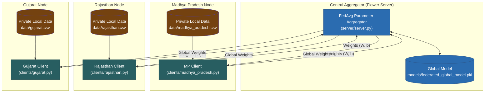

# HealthChain AI — Federated Learning Component

Federated Learning (FL) subsystem for **HealthChain AI**, demonstrating collaborative medicine demand forecasting across multiple decentralized state-level healthcare nodes (**Madhya Pradesh**, **Rajasthan**, **Gujarat**) without centralizing or sharing private local patient footfall and consumption datasets.

---

## 🏛️ Centralized vs. Federated Learning: Architectural Comparison

```text
CENTRALIZED APPROACH:
State A raw data ─┐
State B raw data ─┼──> Central server
State C raw data ─┘

FEDERATED APPROACH:
State A → Local training ─┐
State B → Local training ─┼──> Model aggregation
State C → Local training ─┘
```

> **Core Principle:**
> *"Raw local training data remains at the simulated state node. Only model parameters/updates participate in aggregation."*

### Key Comparison Summary

| Dimension | Centralized Learning | Federated Learning (HealthChain AI) |
| :--- | :--- | :--- |
| **Data Locality** | All raw patient/consumption datasets are transmitted to central cloud | Raw data remains 100% strictly local at the state node |
| **What is Transmitted** | Raw CSV records / patient footfall data | Mathematical model updates (weights $W$ and bias $b$) |
| **Data Privacy** | High compliance risk (PII / cross-state jurisdiction boundaries) | Local data isolation; raw records never leave the node |
| **Bandwidth Usage** | High (scales with millions of patient/transaction rows) | Minimal (scales with compact parameter tensor size) |
| **Aggregation Method** | Single central model trained on unified global dataset | Federated Averaging (FedAvg) aggregates distributed parameter updates |

> [!NOTE]
> **Privacy Consideration:**
> Model parameter aggregation avoids transmitting raw datasets across nodes. Note that model updates alone do not theoretically guarantee complete differential privacy against advanced inference attacks; this prototype serves as a hackathon architectural demonstration of decentralized parameter-based collaborative intelligence.

---

## 🔒 Privacy-Preserving Architecture

In conventional centralized ML, state health departments would be required to transmit all local hospital and PHC records to a central cloud server, raising data privacy, regulatory, and bandwidth concerns.

In **HealthChain AI Federated Learning**:
1. **Raw Data Stays Local:** Each state healthcare node trains a local model strictly on its own private inventory and patient footfall dataset.
2. **Weight Updates Only:** Only model weights ($W$) and bias terms ($b$) are transmitted to the Central Aggregation Server via gRPC.
3. **Federated Averaging (FedAvg):** The central server aggregates parameters across all participating states using weighted FedAvg:
   $$W_{\text{global}} = \sum_{k=1}^{K} \frac{n_k}{N} W_k$$
4. **Global Model Broadcast:** The updated global model weights are broadcast back to the state nodes for the next round of local training.



---

## 📁 Directory Structure

```text
federated-ai/
├── server/
│   └── server.py              # Central Flower FedAvg server
├── clients/
│   ├── madhya_pradesh.py      # Madhya Pradesh state node
│   ├── rajasthan.py           # Rajasthan state node
│   └── gujarat.py             # Gujarat state node
├── data/
│   ├── generate_state_data.py # Synthetic state dataset generator
│   ├── madhya_pradesh.csv     # Local MP training data (750 records)
│   ├── rajasthan.csv          # Local Rajasthan training data (750 records)
│   └── gujarat.csv            # Local Gujarat training data (750 records)
├── models/
│   ├── global_model           # Final aggregated global model artifact
│   ├── global_model.pkl       # Serialized pickle artifact
│   └── training_metadata.json # Training rounds & client metadata JSON
├── common/
│   ├── __init__.py
│   ├── model.py               # FederatedDemandModel & load_global_model()
│   ├── client.py              # Reusable HealthChainStateClient base
│   └── utils.py               # Preprocessing, data loading & metrics
├── compare_approaches.py      # Architectural comparison demonstration
├── test_federated.py          # Comprehensive validation & test suite
├── run_federated.py           # Multi-node automated simulation runner
├── requirements.txt           # Python dependencies
└── README.md
```

---

## 🔮 Inference & Model Loading

The trained federated global model can be loaded for inference, downstream microservices, or backend integration using `load_global_model()`:

```python
from common.model import load_global_model
import numpy as np

# Load the trained global model
model = load_global_model()

# Run prediction with feature vector
# features: [patient_count, previous_consumption, current_stock, day_of_week, month, emergency_flag, ...medicines]
sample_features = np.array([[180, 35, 120, 3, 9, 0, 1, 0, 0, 0, 0, 0, 0, 0, 0, 0, 0, 0, 0, 0, 0]])
predicted_demand = model.predict(sample_features)
print(f"Predicted Daily Consumption: {predicted_demand[0]:.1f} units")
```

### Training Metadata (`models/training_metadata.json`)

```json
{
  "model_name": "HealthChain Federated Demand Model",
  "version": "1.0.0",
  "algorithm": "FedAvg",
  "status": "READY",
  "data_type": "synthetic",
  "number_of_clients": 3,
  "number_of_federated_rounds": 3,
  "participating_states": [
    "Madhya Pradesh",
    "Rajasthan",
    "Gujarat"
  ],
  "training_timestamp": "2026-09-25T02:43:14.864381+00:00",
  "evaluation_metrics": {
    "mae": 4.482,
    "rmse": 5.252,
    "r2": 0.7775
  },
  "number_of_local_samples_per_client": {
    "Madhya Pradesh": 600,
    "Rajasthan": 600,
    "Gujarat": 600
  },
  "privacy_profile": {
    "data_locality": "Raw healthcare data remains on local state client nodes",
    "transmitted_data": "Model weight vectors and gradients only",
    "pii_detected": false
  }
}
```

---

## 🌐 Federated REST API Integration

The platform provides REST endpoints for querying federated network status and executing global model inference:

| Endpoint | Method | Component | Description |
|---|---|---|---|
| `http://localhost:5000/api/federated/status` | `GET` | Node.js Backend | High-level federated model summary for dashboard cards |
| `http://localhost:5000/api/federated/metadata` | `GET` | Node.js Backend | Full training rounds, participating states, and local metrics |
| `http://localhost:8000/federated/status` | `GET` | FastAPI Service | Direct microservice query for FL status |
| `http://localhost:8000/federated/metadata` | `GET` | FastAPI Service | Direct microservice query for FL training metadata |
| `http://localhost:8000/federated/predict` | `POST` | FastAPI Service | Run demand prediction directly via global federated parameters |


---

## 🚀 Setup & Execution Guide

### 1. Install Dependencies

```bash
cd federated-ai
pip install -r requirements.txt
```

### 2. Generate Local State Datasets

```bash
cd data
python generate_state_data.py
cd ..
```

---

### 3. Run the Federated Learning Simulation

#### Option A: Automated One-Command Runner (Recommended)

Runs the central server and all 3 state clients concurrently:

```bash
python run_federated.py
```

#### Option B: Manual Multi-Terminal Execution

Open 4 separate terminal windows:

**Terminal 1 — Central Server:**
```bash
python server/server.py
```

**Terminal 2 — Madhya Pradesh Node:**
```bash
python clients/madhya_pradesh.py
```

**Terminal 3 — Rajasthan Node:**
```bash
python clients/rajasthan.py
```

**Terminal 4 — Gujarat Node:**
```bash
python clients/gujarat.py
```

---

## 📊 Evaluation Metrics

During each federated round, state nodes report validation metrics ($R^2$, MAE, RMSE) on their local unseen validation split. The central aggregator computes sample-weighted global performance metrics:

- **Mean Absolute Error (MAE):** Average absolute difference between predicted and actual consumption
- **Root Mean Squared Error (RMSE):** Penalizes larger deviation spikes
- **$R^2$ Score:** Proportion of variance in medicine demand explained by the federated model

---

## ⚠️ Important Hackathon Disclaimer

- **Simulation Prototype:** This implementation simulates distributed state nodes on local processes for hackathon demonstration.
- **Synthetic Data:** All healthcare records are generated synthetically (no real patient information or PII).
- **Not Production Medical System:** Intended to showcase architectural feasibility of privacy-preserving federated intelligence for public health supply chains.
